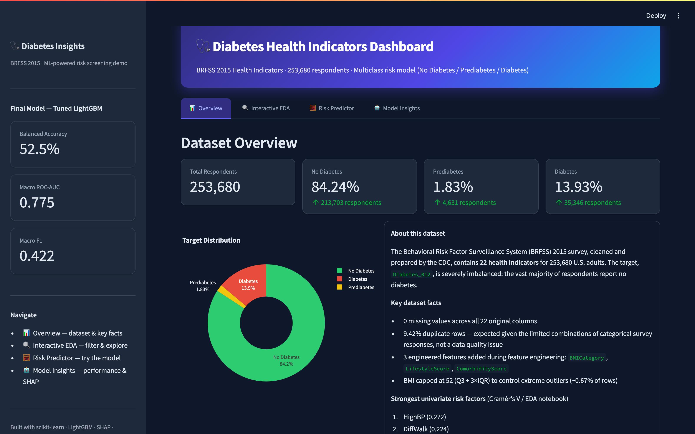
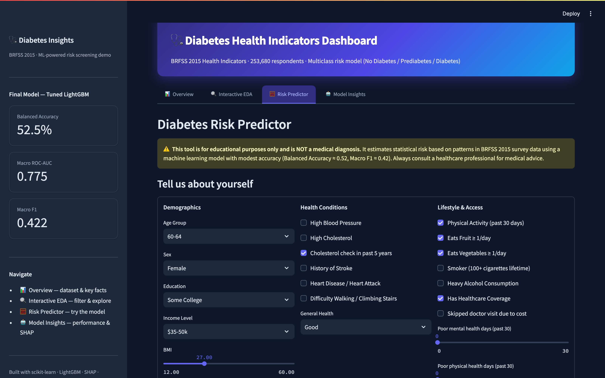

<h1 align="center">🩺 Diabetes Risk Prediction — BRFSS 2015</h1>

<p align="center">
  
  
  
  
  
  
</p>

<p align="center">
  End-to-end machine learning project on the <b>Behavioral Risk Factor Surveillance System (BRFSS) 2015</b> health indicators dataset
  (253,680 respondents, 22 health indicators). Predicts diabetes status — <b>No Diabetes / Prediabetes / Diabetes</b> —
  from lifestyle and health survey responses, and surfaces the results in an interactive risk-screening dashboard.
</p>

<p align="center">
  🔗 <b>Live dashboard:</b> <i>add your deployed Streamlit URL here once published</i>
</p>

---

## 🖼️ Dashboard Preview

<p align="center">
  
  <br><em>Overview — dataset summary, target distribution, key risk factors</em>
</p>

<p align="center">
  
  <br><em>Risk Predictor — live diabetes-risk estimate from a short health & lifestyle form</em>
</p>

---

## 📋 Contents

- [Project Structure](#-project-structure)
- [Key Findings](#-key-findings)
- [Modeling Results](#-modeling-results-test-set)
- [Dashboard](#-dashboard)
- [Data Source](#-data-source)
- [Tech Stack](#-tech-stack)

## 📁 Project Structure

```
diabetes-analysis/
├── data/
│   ├── diabetes_012_health_indicators_BRFSS2015.csv   # raw BRFSS 2015 data
│   └── processed/                                     # cleaned, engineered, split data
├── notebooks/
│   ├── 01_eda.ipynb                                   # exploratory data analysis
│   ├── 02_feature_engineering.ipynb                   # feature pipeline derived from EDA findings
│   └── 03_modeling.ipynb                              # model training, tuning, SHAP, final evaluation
├── src/
│   └── features.py                                    # shared feature engineering module
├── models/
│   ├── lightgbm_diabetes_final.pkl                    # final tuned LightGBM model
│   ├── model_metadata.json                            # feature list, class labels, best params, test metrics
│   ├── model_comparison.csv                           # all model results (val + test)
│   └── shap_feature_importance.csv                    # SHAP-based global feature importance
├── reports/figures/                                   # exported EDA, SHAP & dashboard preview images
├── dashboard/
│   └── app.py                                         # Streamlit dashboard (Overview, EDA, Risk Predictor, Model Insights)
├── .streamlit/config.toml                             # dashboard theme
└── requirements.txt
```

## 🔍 Key Findings

- The dataset is severely imbalanced: **84.2% No Diabetes, 1.8% Prediabetes, 13.9% Diabetes**.
- Strongest univariate risk factors (Cramér's V): `HighBP`, `DiffWalk`, `GenHlth`, `HighChol`, `Age`.
- Three engineered features — **BMI Category**, **Lifestyle Score**, **Comorbidity Score** — were added on top of the 21 raw indicators.
- SHAP confirms `GenHlth`, `Age`, `ComorbidityScore`, and `BMI` as the top global drivers of risk predictions.

## 📊 Modeling Results (Test Set)

| Model | Accuracy | Balanced Accuracy | Macro F1 | Macro ROC-AUC |
|---|---|---|---|---|
| Dummy (Most Frequent) | 0.842 | 0.333 | 0.305 | – |
| Logistic Regression | 0.642 | 0.528 | 0.428 | 0.777 |
| Random Forest | 0.713 | 0.501 | 0.433 | 0.761 |
| XGBoost | 0.655 | 0.496 | 0.420 | 0.752 |
| LightGBM | 0.673 | 0.498 | 0.425 | 0.744 |
| **LightGBM (Tuned, Final) — TEST SET** | **0.628** | **0.525** | **0.422** | **0.775** |

Because the target is severely imbalanced, models are compared using **macro-F1**, **balanced accuracy**, and **macro ROC-AUC** rather than raw accuracy. The tuned LightGBM model was selected as the final model and retrained on train+validation before the held-out test evaluation above.

> **Limitation:** with a macro-F1 of ~0.42, this model is best framed as a *screening aid* highlighting elevated-risk individuals for further evaluation — not a diagnostic tool.

## 🖥️ Dashboard

The Streamlit dashboard (`dashboard/app.py`) has four tabs:

1. **📊 Overview** — dataset summary, target distribution, key risk factors, executive summary figure.
2. **🔍 Interactive EDA** — filter the population by age, sex, and BMI category; explore feature distributions and diabetes prevalence by group.
3. **🧮 Risk Predictor** — fill in a short health/lifestyle form to get a predicted diabetes-risk class with probability breakdown.
4. **🤖 Model Insights** — model comparison table, SHAP global feature importance, confusion matrix, and classification report for the final model.

### Running locally

```bash
pip install -r requirements.txt
streamlit run dashboard/app.py
```

## 📚 Data Source

[BRFSS 2015 Diabetes Health Indicators Dataset](https://www.kaggle.com/datasets/alexteboul/diabetes-health-indicators-dataset) (CDC Behavioral Risk Factor Surveillance System, 2015), via Kaggle.

## 🛠️ Tech Stack

`pandas` · `numpy` · `scikit-learn` · `LightGBM` · `XGBoost` · `SHAP` · `Streamlit` · `Plotly`
